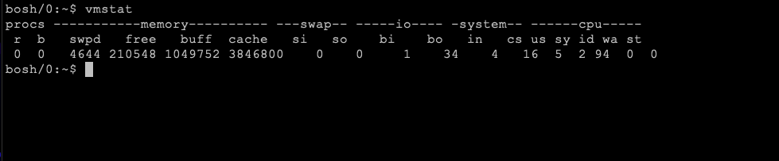
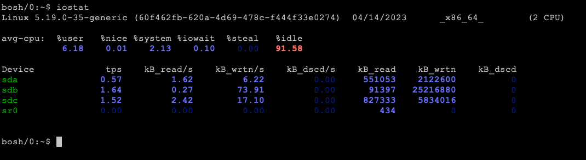

# BOSH-VM-System-Monitoring-Tools

BOSH Director is a very resource-intensive application. We need to ensure that the system running BOSH Director has sufficient resources for things like CPU, memory, disk, and network bandwidth. If you are experiencing performance issues with the BOSH Director, there are out-of-the-box system monitoring tools like top, htop, vmstat and iostat that monitor the resource utilization on the system and can help narrow down where the performance issue is coming from. We will talk briefly about each of these tools to understand its output and what it means.

# TOP 

Here’s how to understand this output:

+ Load average: The 3 numbers that represent the average system load over the last 1, 5, and 15 mins. A load average of 1.00 equates to 1 CPU core being 100% utilized. If you have 16 CPU cores with a load average of 8.00, that would mean that you have 8 out of 16 cores being 100% utilized or 50% usage of the total CPU for your system.
+ Tasks: This is the number of tasks running on your system broken down by the statuses of each task (running, sleeping, stopped, zombie).
+ CPU usage: The %CPU column will give you the percentage of CPU each process is using. The %MEM column will give you the percentage of memory being used by each process.
+ Memory usage: KiB Mem and KiB Swap lines will give you the total memory and swap space on your system along with the amount of free, used, and cached memory.
+ Process list: PID, USER, PR, NI, VIRT, RES, SHR, S, %CPU, %MEM, TIME+, and COMMAND columns will give you the info. on each process on your system. 
  + PID = process ID
  + USER = username of the process owner
  + PR = process priority
  + NI = nice value
  + VIRT = total virtual memory being used
  + RES = resident set size (basically, the amount of physical memory being used)
  + SHR = shared memory size
  + S = Status of the process i.e. running, sleeping, stopped, etc.
  + %CPU = percentage of CPU usage for each process
  + %MEM = percentage of memory usage for each process
  + TIME+ = total CPU time for each process
  + COMMAND = name of process

Identifying potential problems:

+ High load average: A consistently high load average may indicate that the system is under heavy load and may need additional resources or optimizations to keep up with demand.
+ High CPU usage: A process consistently using a high percentage of CPU may indicate a performance bottleneck or a runaway process. It may be necessary to investigate the cause of the high CPU usage and take steps to mitigate the issue.
+ Low memory: If the system is consistently running low on memory, it may lead to slow performance and even system crashes. It may be necessary to free up memory or add additional memory to the system.
+ Non-responsive processes: If a process is in a non-responsive or zombie state, it may indicate a problem with the system or the process itself. It may be necessary to investigate the cause of the issue and take steps to fix it.

# HTOP

htop is a command-line process monitoring tool for Linux/Unix systems. It is a more advanced version of the top command, which provides real-time system monitoring by displaying a list of processes and their resource usage statistics. htop is a free and open-source tool that provides a more user-friendly and interactive interface than the traditional top command.

Here’s how to understand this output:

When you run htop, it displays a list of processes that are currently running on your system. The output is organized in columns, and each column represents a specific resource usage metric. Some of the most commonly used columns include:

+ PID: This column shows the process ID number of each running process.
+ USER: This column shows the username of the user who initiated the process.
+ CPU%: This column shows the percentage of CPU resources currently being used by each process.
+ MEM%: This column shows the percentage of memory resources currently being used by each process.
+ VIRT: This column shows the virtual memory usage of each process.
+ RES: This column shows the physical memory usage of each process.
+ TIME+: This column shows the total CPU time consumed by each process.
+ COMMAND: This column shows the name of the command that is currently being executed.

htop also provides several color-coded indicators that can help you quickly identify processes that are consuming high amounts of resources. For example, processes that are using a lot of CPU resources will be highlighted in red, while processes that are using a lot of memory will be highlighted in blue.

Identifying potential problems:

+ High CPU usage: If you notice that a particular process or multiple processes are consistently using a high percentage of CPU resources, it may indicate that there is a performance issue that needs to be addressed. You can use htop to identify the specific process or processes that are causing the issue and take appropriate action to optimize or terminate them.
+ High memory usage: If you notice that a particular process or multiple processes are consistently using a high percentage of memory resources, it may indicate that there is a memory leak or other performance issue that needs to be addressed. You can use htop to identify the specific process or processes that are causing the issue and take appropriate action to optimize or terminate them.
+ Processes in a state of deadlock or waiting: If you notice that a particular process or multiple processes are stuck in a state of deadlock or waiting, it may indicate that there is a problem with the system configuration or application code. You can use htop to identify the specific process or processes that are stuck and take appropriate action to resolve the issue.

# VMSTAT

vmstat is a command-line tool for Linux/Unix systems that provides real-time system monitoring and performance analysis. It displays a variety of system statistics, including CPU usage, memory usage, disk I/O, and more. vmstat is a free and open-source tool that is commonly used by system administrators and developers to identify performance issues and optimize system resources.

Here’s how to understand this output:

When you run vmstat, it displays a variety of statistics that can be used to monitor system performance. The output is organized in columns, and each column represents a specific system metric. Some of the most commonly used columns include:

+ r: This column shows the number of processes that are currently waiting for CPU resources.
+ b: This column shows the number of processes that are currently blocked and waiting for I/O resources.
+ us: This column shows the percentage of CPU resources currently being used by user-level processes.
+ sy: This column shows the percentage of CPU resources currently being used by system-level processes.
+ id: This column shows the percentage of CPU resources that are currently idle.
+ wa: This column shows the percentage of CPU resources that are currently being used for I/O operations.
+ si: This column shows the amount of memory that is being swapped in from disk.
+ so: This column shows the amount of memory that is being swapped out to disk.
+ bi: This column shows the amount of data that is being read from disk.
+ bo: This column shows the amount of data that is being written to disk.

vmstat also provides several color-coded indicators that can help you quickly identify processes that are consuming high amounts of resources. For example, processes that are using a lot of CPU resources will be highlighted in red, while processes that are using a lot of memory will be highlighted in blue.

Identifying potential problems:

 + High CPU usage: If you notice that the us or sy columns are consistently showing a high percentage of CPU usage, it may indicate that there is a performance issue that needs to be addressed. You can use vmstat to identify the specific processes that are causing the issue and take appropriate action to optimize or terminate them.

+ High I/O wait times: If you notice that the wa column is consistently showing a high percentage of CPU usage, it may indicate that there is a problem with disk I/O performance. You can use vmstat to identify the specific processes that are causing the issue and take appropriate action to optimize or terminate them.

+ Memory issues: If you notice that the si or so columns are consistently showing a high amount of memory being swapped in or out from disk, it may indicate that there is a memory issue that needs to be addressed. You can use vmstat to identify the specific processes that are causing the issue and take appropriate action to optimize or terminate them.

# IOSTAT

iostat is a command-line tool that provides real-time system monitoring and performance analysis for input/output (I/O) operations in Linux/Unix systems. It can help you identify I/O bottlenecks, disk usage, and other performance issues. iostat is a free and open-source tool that is commonly used by system administrators and developers to optimize system resources.

Here’s how to understand this output:

When you run iostat, it displays a variety of statistics that can be used to monitor I/O performance. The output is organized in columns, and each column represents a specific system metric. Some of the most commonly used columns include:

+ Device: This column displays the name of the device being monitored.
+ tps: This column displays the number of I/O transactions per second.
+ kB_read/s: This column displays the amount of data read from the device in kilobytes per second.
+ kB_wrtn/s: This column displays the amount of data written to the device in kilobytes per second.
+ kB_read: This column displays the total amount of data read from the device since the system was last booted.
+ kB_wrtn: This column displays the total amount of data written to the device since the system was last booted.

iostat also provides several color-coded indicators that can help you quickly identify devices that are experiencing high levels of I/O activity. For example, devices that are experiencing high levels of I/O activity will be highlighted in red, while devices that are not experiencing much I/O activity will be highlighted in green.

Identifying potential problems:

iostat can be a valuable tool for identifying I/O performance issues and troubleshooting problems. Some of the most common issues that can be spotted using iostat include:

Disk bottlenecks: If you notice that a specific device is consistently experiencing high levels of I/O activity, it may indicate that there is a disk bottleneck that needs to be addressed. You can use iostat to identify the specific device that is causing the issue and take appropriate action to optimize or replace it.

Slow I/O performance: If you notice that the tps column is consistently showing a low number of I/O transactions per second, it may indicate that there is a problem with I/O performance. You can use iostat to identify the specific device that is causing the issue and take appropriate action to optimize or replace it.

I/O errors: If you notice that the iostat output is showing a high number of I/O errors, it may indicate that there is a problem with the device or the file system. You can use iostat to identify the specific device that is causing the issue and take appropriate action to troubleshoot and resolve the errors.

