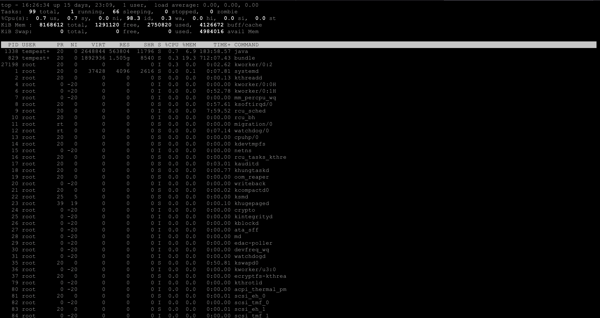
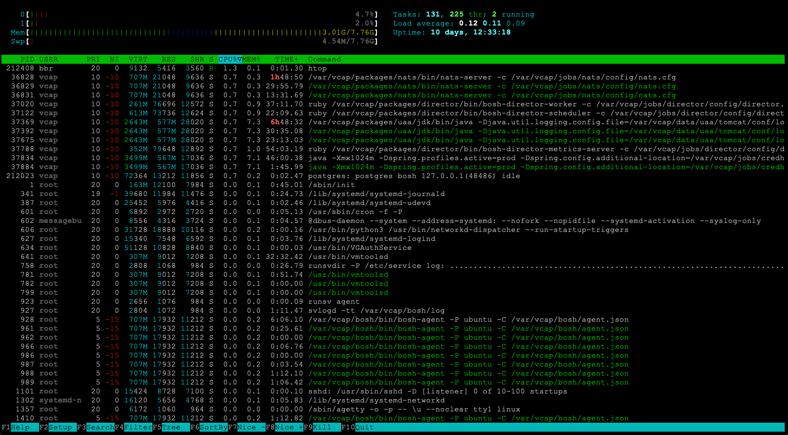

# BOSH-VM-System-Monitoring-Tools

BOSH Director is a very resource-intensive application. We need to ensure that the system running BOSH Director has sufficient resources for things like CPU, memory, disk, and network bandwidth. If you are experiencing performance issues with the BOSH Director, there are out-of-the-box system monitoring tools like top, htop, vmstat and iostat that monitor the resource utilization on the system and can help narrow down where the performance issue is coming from. We will talk briefly about each of these tools to understand its output and what it means.

# TOP 

Here’s how to understand this output:

+ Load average: The 3 numbers that represent the average system load over the last 1, 5, and 15 mins. A load average of 1.00 equates to 1 CPU core being 100% utilized. If you have 16 CPU cores with a load average of 8.00, that would mean that you have 8 out of 16 cores being 100% utilized or 50% usage of the total CPU for your system.
+ Tasks: This is the number of tasks running on your system broken down by the statuses of each task (running, sleeping, stopped, zombie).
+ CPU usage: The %CPU column will give you the percentage of CPU each process is using. The %MEM column will give you the percentage of memory being used by each process.
+ Memory usage: KiB Mem and KiB Swap lines will give you the total memory and swap space on your system along with the amount of free, used, and cached memory.
+ Process list: PID, USER, PR, NI, VIRT, RES, SHR, S, %CPU, %MEM, TIME+, and COMMAND columns will give you the info. on each process on your system. 
  + PID = process ID
  + USER = username of the process owner
  + PR = process priority
  + NI = nice value
  + VIRT = total virtual memory being used
  + RES = resident set size (basically, the amount of physical memory being used)
  + SHR = shared memory size
  + S = Status of the process i.e. running, sleeping, stopped, etc.
  + %CPU = percentage of CPU usage for each process
  + %MEM = percentage of memory usage for each process
  + TIME+ = total CPU time for each process
  + COMMAND = name of process

Identifying potential problems:

+ High load average: A consistently high load average may indicate that the system is under heavy load and may need additional resources or optimizations to keep up with demand.
+ High CPU usage: A process consistently using a high percentage of CPU may indicate a performance bottleneck or a runaway process. It may be necessary to investigate the cause of the high CPU usage and take steps to mitigate the issue.
+ Low memory: If the system is consistently running low on memory, it may lead to slow performance and even system crashes. It may be necessary to free up memory or add additional memory to the system.
+ Non-responsive processes: If a process is in a non-responsive or zombie state, it may indicate a problem with the system or the process itself. It may be necessary to investigate the cause of the issue and take steps to fix it.

# HTOP

Here’s how to understand this output:
